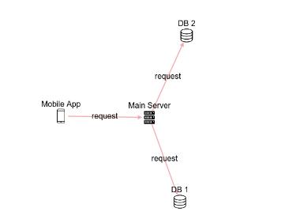
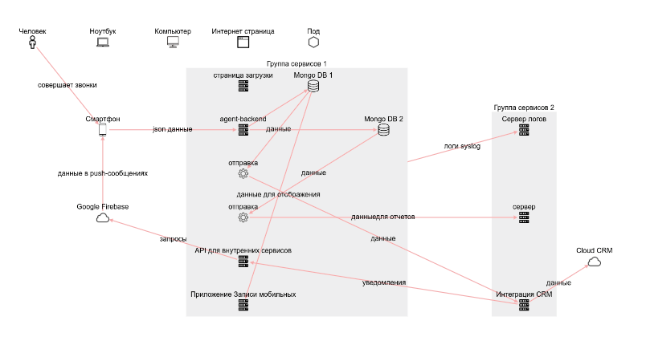

# Схема сети как код

Этот скрипт позволяет нарисовать схему сети, описав ее в виде кода. Нарисовать новую или исправить старую схему - легко - поправить пару строк кода. Смотрите сами ;)

## Пример



Вот код, который описывает эту схему

`````javascript
  const elements = {
    nodes: [                                                    // описываем узлы
      { id: 'client', type: 'smartphone', label: 'Mobile App'},
      { id: 'server', type: 'server', label: 'Main Server'},
      { id: 'db1', type: 'database', label: 'DB 1'},
      { id: 'db2', type: 'database', label: 'DB 2'},
    ],
    edges: [                                                    // указываем связи
      { source: 'client', target: 'server', label: 'request' },
      { source: 'server', target: 'db1', label: 'request' },
      { source: 'server', target: 'db2', label: 'request' },
    ],
  };
  Diagram('scheme1', elements);
`````

## Как начать использовать?

1. Добавьте в ваш html загрузку скрипта

`````javascript
<script src="https://unpkg.com/@antirek/network-diagram@0.1.3/dist/code-full.min.js"></script>

`````
2. Добавьте div для схемы, задав ширину и высоту

`````javascript
  <div id="scheme1" style="height:300px;width:800px;"></div>
`````

3. Опишите вашу схему сети

- опишите узлы: id, type, label

- укажите связи: source - id узла, target - id узла

`````javascript
<script>      
  const elements = {    
    nodes: [                                                    // описываем узлы
      { id: 'client', type: 'smartphone', label: 'Mobile App'},
      { id: 'server', type: 'server', label: 'Main Server'},
      { id: 'db1', type: 'database', group: 'db cluster', label: 'DB 1'},
      { id: 'db2', type: 'database', group: 'db cluster', label: 'DB 2'},
    ],
    edges: [                                                    // указываем связи
      { source: 'client', target: 'server', label: 'request' },
      { source: 'server', target: 'db1', label: 'request' },
      { source: 'server', target: 'db2', label: 'request' },
    ],
  };
  Diagram('scheme1', elements);
</script>
`````

Весь этот код в одном файле [example.html](examples/example.html)

## Опции

Для отрисовки схемы используется [cytoscape.js](https://js.cytoscape.org/). Схема отрисовывается в двух режимах: auto и grid. Для grid режима необходимо указать positions. Positions - это список элементов с указанием строки и колонки их расположения. Явное указание positions позволяет точно зафиксировать вид схемы.

- укажите id узла и позицию: row - номер строки, col - номер колонки

`````javascript
  positions: [
    { id: 'client', row: 1, col: 2, },
    { id: 'server', row: 2, col: 4, },
    { id: 'db1', row: 1, col: 5, },
    { id: 'db2', row: 3, col: 5, },
  ]
`````

#### Пример кода layout = grid

`````javascript
  const elements = {    
    nodes: [
      { id: 'client', type: 'smartphone', label: 'Mobile App'},
      { id: 'server', type: 'server', label: 'Main Server'},
      { id: 'db1', type: 'database', group: 'db cluster', label: 'DB 1'},
      { id: 'db2', type: 'database', group: 'db cluster', label: 'DB 2'},
    ],
    edges: [
      { source: 'client', target: 'server', label: 'request' },
      { source: 'server', target: 'db1', label: 'request' },
      { source: 'server', target: 'db2', label: 'request' },
    ],
    positions: [
      { id: 'client', row: 1, col: 2, },
      { id: 'server', row: 2, col: 4, },
      { id: 'db1', row: 1, col: 5, },
      { id: 'db2', row: 3, col: 5, },
    ],
  };
  Diagram('scheme', elements, {layout:'grid'});
`````

## Типы elements

- nodes - узлы
- edges - связи
- groups - группы
- positions - расположение (для layout = grid)


## Типы nodes

Для nodes можно указать type, который меняет отображаемую иконку объекта. 

Доступные type

- smartphone
- desktop
- notebook
- server
- pod
- database
- cloud
- person
- webpage
- document
- worker


## Группы

Для nodes можно указать group. Список group необходимо указать в elements.

`````javascript
  const elements = {
    nodes: [
      { id: 'client', type: 'smartphone', label: 'Smartphone'},
      { id: 'server', type: 'server', label: 'Main Server'},
      { id: 'db1', type: 'database', group: 'db cluster', label: 'DB 1'},
      { id: 'db2', type: 'database', group: 'db cluster', label: 'DB 2'},
    ],
    edges: [
      { source: 'server', target: 'db cluster', label: 'grpc' },
      { source: 'client', target: 'server', label: 'request' },
    ],
    groups: [
      { id: 'db cluster', label: 'Main Database cluster'},
    ],
  };
  Diagram('scheme', elements);
`````

## Примеры

Еще примеры схем: группы, цветные связи, позиции а-ля "Морской бой" https://antirek.github.io/network-diagram/


